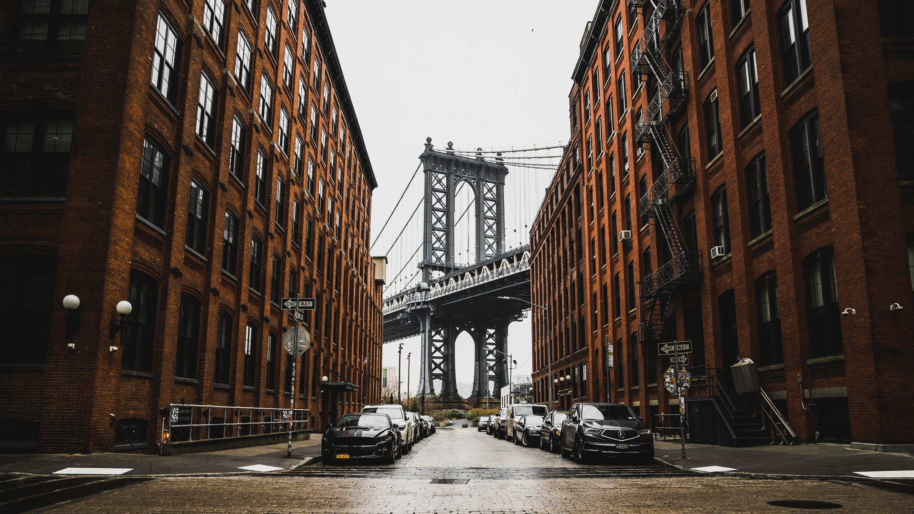

# Les display-block CSS

Cours sur les display-block et inline.

[Lien vers le projet](https://capura94.github.io/display-block-22/)

>Exemple de code HTML
```html 
<div class="gallery-primary" role="group" aria-labelledby="pictures">
    <ul id="pictures">
        <li></li>
        <li></li>
        <li></li>
        <li></li>
        <!-- two pictures -->
        <li></li>
        <li></li>
                <!-- last image -->
        <li></li>
    </ul>
</div>
```
>Exemple de code CSS
```css
html{
    font-size: 62.5%;
    background-color: #222;
}
body{
    font: 1.6rem "Roboto Slab", sans-serif;
    margin: 0;
    line-height: 1.6;
    letter-spacing: .1rem;
}
h1,h2,h3,h4,h5,h6,
ul,ol,p,figure{
    margin: 0;
    padding: 0;
    list-style: none;   
}
```